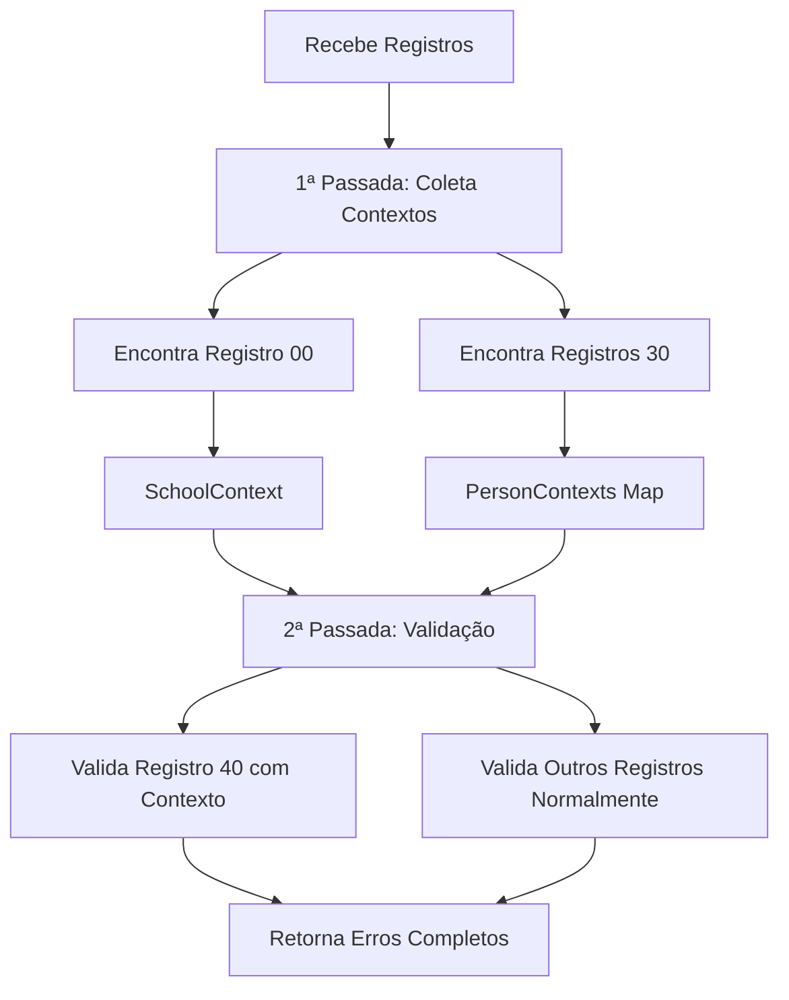

# Sistema de Validação com Contexto - Registro 40

## Resumo

O registro 40 (Vínculo de Gestor Escolar) foi implementado com **validação cruzada**, permitindo verificar dados em relação aos registros 00 (Identificação da Escola) e 30 (Pessoas Físicas).

## Como Funciona

### 1. Validação Tradicional

```typescript
// Validação básica sem contexto
const rule = new SchoolManagerBondRule();
const errors = rule.validate(parts, lineNumber);
```

### 2. Validação com Contexto (NOVA)

```typescript
// Validação com dados de outros registros
const errors = rule.validateWithContext(
  parts,
  lineNumber,
  schoolContext, // Dados do registro 00
  personContext, // Dados do registro 30
  existingBonds, // Vínculos já existentes
);
```

## Contextos Necessários

### SchoolContext (Registro 00)

```typescript
interface SchoolContext {
  codigoInep: string; // Campo 2 do registro 00
  situacaoFuncionamento: string; // Campo 3 do registro 00 (posição 2)
  dependenciaAdministrativa: string; // Campo 21 do registro 00 (posição 20)
}
```

### PersonContext (Registro 30)

```typescript
interface PersonContext {
  codigoPessoa: string; // Campo 3 do registro 30 (posição 2)
  identificacaoInep?: string; // Campo 4 do registro 30 (posição 3)
}
```

## Validações Cruzadas Implementadas

### ✅ Código INEP (Campo 2)

- **Regra**: Deve ser igual ao código INEP do registro 00
- **Erro**: "Código INEP deve ser igual ao informado no registro 00"

### ✅ Código da Pessoa (Campo 3)

- **Regra**: Deve existir no registro 30 da mesma escola
- **Erro**: "Não há pessoa física com esse código registrada no registro 30"

### ✅ Identificação INEP (Campo 4)

- **Regra**: Se preenchido, deve ser igual ao do registro 30 correspondente
- **Erro**: "Identificação única deve ser igual à informada no registro 30"

### ✅ Vínculos Duplicados

- **Regra**: Pessoa não pode ter dois vínculos como gestor na mesma escola
- **Erro**: "Pessoa física já possui vínculo como gestor escolar nesta escola"

### ✅ Critério de Acesso (Campo 6)

- **Regra 1**: Obrigatório quando cargo = 1 (Diretor) e escola em atividade
- **Regra 2**: Não pode ser preenchido para cargo != 1 (Diretor)
- **Regra 3**: Não pode ser preenchido quando escola não está ativa
- **Regra 4**: Valor 1 (Proprietário) só para escolas privadas (dep. administrativa = 4)
- **Regra 5**: Valores 4,5,6 (Concurso, Eleição) não podem ser usados em escolas privadas

### ✅ Situação Funcional (Campo 7)

- **Regra 1**: Obrigatório para Diretor em escola pública ativa
- **Regra 2**: Não pode ser preenchido para cargo != 1 (Diretor)
- **Regra 3**: Não pode ser preenchido quando escola não está ativa
- **Regra 4**: Não pode ser preenchido para escolas privadas

## API Endpoints

### POST /validation/validate-with-context

Novo endpoint que processa todos os registros mantendo contexto:

```json
{
  "records": [
    "00|12345678|1|01/02/2025|31/12/2025|||||||||||||||||2|||||||||||||||||||||||||||||||||||||",
    "30|12345678|DIR001|123456789012|12345678901|JOÃO DA SILVA|15/05/1980|1|MARIA DA SILVA||1|1||1|76||||||||||||||||||||||||||||||||||||||||||||||||||||||||||||||||||||||||||||||||||||||||||||||||||||||||||",
    "40|12345678|DIR001|123456789012|1|4|1"
  ],
  "version": "2025"
}
```

## Fluxo de Processamento



## Exemplo de Uso Completo

```typescript
// 1. Dados de contexto
const schoolContext = {
  codigoInep: '12345678',
  situacaoFuncionamento: '1', // Em atividade
  dependenciaAdministrativa: '2', // Estadual
};

const personContext = {
  codigoPessoa: 'DIR001',
  identificacaoInep: '123456789012',
};

// 2. Validação com contexto
const rule = new SchoolManagerBondRule();
const errors = rule.validateWithContext(
  ['40', '12345678', 'DIR001', '123456789012', '1', '4', '1'],
  1,
  schoolContext,
  personContext,
  [], // Sem vínculos existentes
);

// 3. Resultado: 0 erros (registro válido)
console.log(`Erros encontrados: ${errors.length}`);
```

## Cenários de Erro

### ❌ Código INEP Diferente

```typescript
const record = ['40', '99999999', 'DIR001', '123456789012', '1', '4', '1'];
// Erro: Código INEP deve ser igual ao informado no registro 00
```

### ❌ Critério Inválido para Escola Privada

```typescript
const privateSchool = { dependenciaAdministrativa: '4' }; // Privada
const record = ['40', '87654321', 'DIR002', '987654321098', '1', '4', ''];
// Erro: Critérios 4, 5, 6 não podem ser usados em escola privada
```

### ❌ Vínculo Duplicado

```typescript
const existingBonds = ['DIR001']; // Pessoa já tem vínculo
// Erro: Pessoa física já possui vínculo como gestor escolar nesta escola
```

## Benefícios

1. **✅ Validação Completa**: Verifica consistência entre registros
2. **✅ Detecção de Inconsistências**: Identifica dados conflitantes
3. **✅ Regras de Negócio**: Implementa todas as regras específicas do Censo
4. **✅ Performance**: Duas passadas eficientes pelos dados
5. **✅ Flexibilidade**: Funciona com ou sem contexto

## Status: ✅ IMPLEMENTADO E TESTADO

O registro 40 está completamente funcional com todas as validações cruzadas implementadas e pode ser usado tanto no modo básico quanto com contexto completo.
